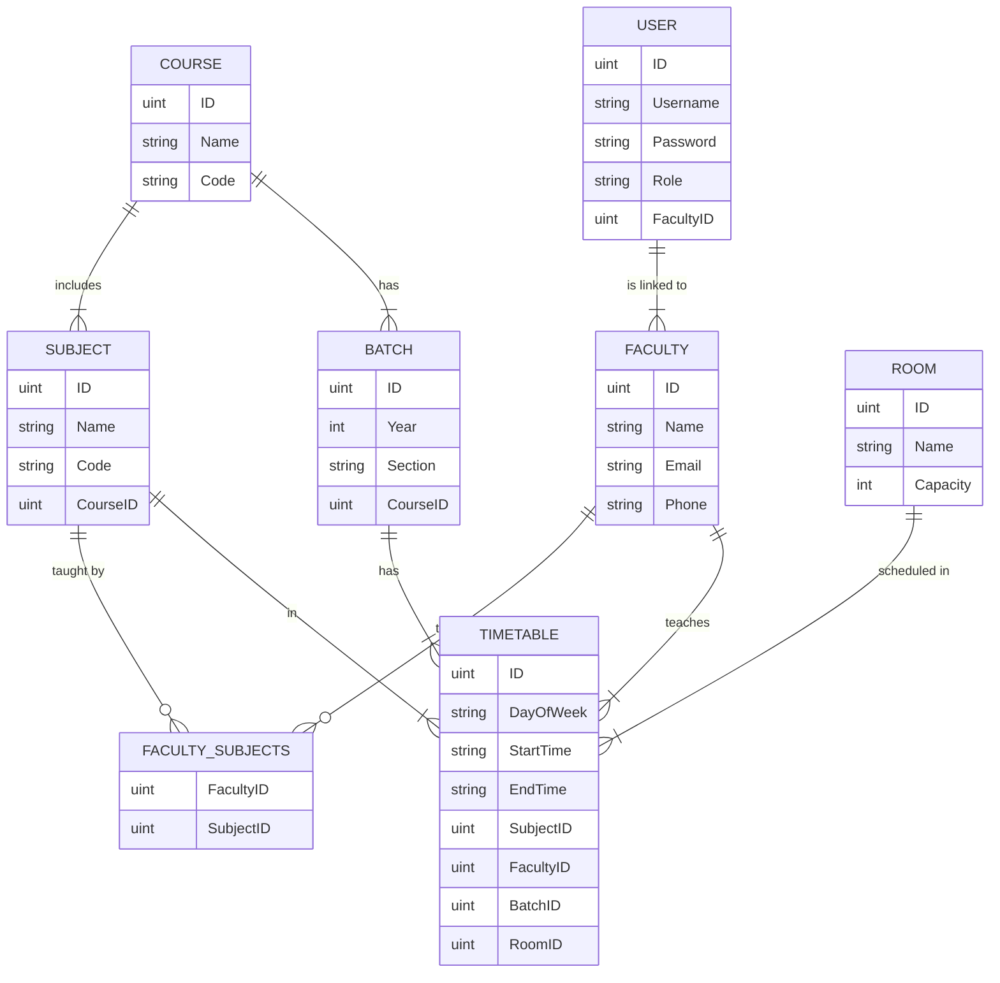

# Timetable Management System

A comprehensive solution for educational institutions to manage and optimize their course timetables. This system provides an intuitive interface for administrators to create, view, and manage timetables for different courses, batches, and faculty members.

## Project Overview

The Timetable Management System consists of two main components:

- **Frontend**: A React-based web application built with Vite
- **Backend**: A Go server with RESTful API endpoints


## Features

- **User Authentication**: Secure login system with role-based access control
- **Dashboard**: Overview of key metrics and quick access to main features
- **Timetable Management**:
  - Create and edit timetables
  - View timetables by batch, faculty, or room
  - Conflict detection and resolution
- **Resource Management**:
  - Faculty profiles and subject expertise
  - Classroom allocation
  - Subject management

## Technology Stack

### Frontend
- React 19
- Vite
- Tailwind CSS
- Shadcn UI Components
- React Router

### Backend
- Go
- PostgreSQL (via Supabase)
- Air (for hot-reloading)

## Database Schema

The system is built around the following entity relationships:



## Installation and Setup

### Prerequisites
- Node.js (v18+)
- Go (v1.19+)
- PostgreSQL database

### Backend Setup
1. Navigate to the backend directory:
   ```
   cd backend
   ```

2. Install Go dependencies:
   ```
   go mod download
   ```

3. Set up environment variables:
   ```
   cp .env.example .env
   ```
   Then edit `.env` and add your database connection string

4. Run the server:
   ```
   go run .
   ```

   For development with hot reloading:
   ```
   # Install air first if you don't have it
   # go install github.com/air-verse/air@latest
   air
   ```

### Frontend Setup
1. Navigate to the frontend directory:
   ```
   cd frontend
   ```

2. Install dependencies:
   ```
   pnpm install
   ```

3. Start the development server:
   ```
   pnpm dev
   ```

4. Build for production:
   ```
   pnpm build
   ```

## Usage Guide

1. **Login**: Access the system with your credentials
2. **Dashboard**: Navigate to different sections using the cards
3. **Create Timetable**: Select batch details and add classes to the grid
4. **View Timetable**: Filter and view existing timetables
5. **Manage Subjects/Rooms**: Add or modify resources available for scheduling

## Project Structure

### Backend
```
backend/
├── config/         # Configuration setup
├── controllers/    # Request handlers
├── docs/           # Documentation and diagrams
├── middleware/     # Authentication and other middleware
├── models/         # Database models
├── routes/         # API endpoints
└── utils/          # Helper functions
```

### Frontend
```
frontend/
├── public/         # Static assets
├── src/
│   ├── assets/     # Images, mock data, etc.
│   ├── components/ # Reusable UI components
│   ├── lib/        # Utility functions
│   └── pages/      # Application pages
└── components.json # Shadcn UI configuration
```

## Contributing

1. Fork the repository
2. Create your feature branch (`git checkout -b feature/amazing-feature`)
3. Commit your changes (`git commit -m 'Add some amazing feature'`)
4. Push to the branch (`git push origin feature/amazing-feature`)
5. Open a Pull Request

## License

This project is licensed under the MIT License - see the LICENSE file for details.
