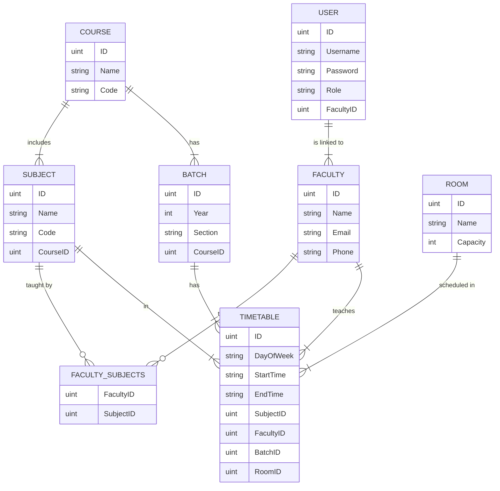

### ER diagram

```mermaid
erDiagram
    USER {
        uint ID
        string Username
        string Password
        string Role
        uint FacultyID
    }
    FACULTY {
        uint ID
        string Name
        string Email
        string Phone
    }
    COURSE {
        uint ID
        string Name
        string Code
    }
    BATCH {
        uint ID
        int Year
        string Section
        uint CourseID
    }
    SUBJECT {
        uint ID
        string Name
        string Code
        uint CourseID
    }
    ROOM {
        uint ID
        string Name
        int Capacity
    }
    TIMETABLE {
        uint ID
        string DayOfWeek
        string StartTime
        string EndTime
        uint SubjectID
        uint FacultyID
        uint BatchID
        uint RoomID
    }
    FACULTY_SUBJECTS {
        uint FacultyID
        uint SubjectID
    }

    USER ||--|{ FACULTY : "is linked to"
    COURSE ||--|{ BATCH : "has"
    COURSE ||--|{ SUBJECT : "includes"
    BATCH ||--|{ TIMETABLE : "has"
    SUBJECT ||--|{ TIMETABLE : "in"
    FACULTY ||--|{ TIMETABLE : "teaches"
    ROOM ||--|{ TIMETABLE : "scheduled in"
    FACULTY ||--o{ FACULTY_SUBJECTS : "teaches"
    SUBJECT ||--o{ FACULTY_SUBJECTS : "taught by"
```
